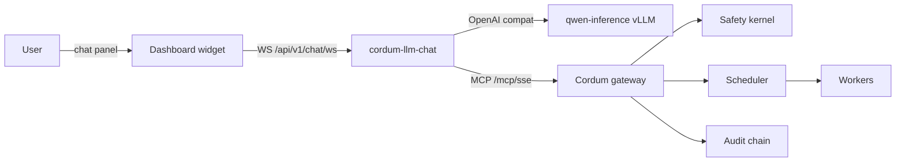

# Cordum LLM Chat Assistant

The Cordum chat assistant is a self-hosted natural-language interface to your Cordum control plane. Operators ask questions ("show me denied jobs from the last hour"), the assistant calls Cordum's existing REST + MCP tools to answer them, and every action traverses the same policy + approval + audit pipeline as any other Cordum agent.

## Architecture



The chat-assistant service sits behind the gateway as a regular MCP client. It cannot bypass any existing governance — every tool call goes through the same `ApprovalGate` + `ToolInvocationAuditor` + SIEMEvent pipeline.

## Security model

- **Zero external egress by default.** Inference runs locally via vLLM; no traffic leaves the cluster. Set `LLMCHAT_BASE_URL` to opt into an external endpoint.
- **Per-session delegation tokens.** Each chat session mints a 15-minute EdDSA JWT scoped to the user's principal + tenant. The service-account API key never reaches per-user tool-call paths.
- **Preapproved mutation set is one tool.** `cordum_submit_job` is the only mutation that runs without an inline Approve/Reject prompt. Every other mutation (`cordum_approve_job`, `cordum_reject_job`, `cordum_cancel_job`, `cordum_trigger_workflow`) surfaces an inline approval prompt in the chat panel.
- **Tool-result redaction.** All tool results pass through `core/mcp/DefaultRedactor()` before re-entering LLM context — defends against prompt-injection-via-tool-output that exfiltrates secrets.
- **Audit lifecycle events.** Every WebSocket connect/disconnect emits `chat.session_started` / `chat.session_closed` events into the audit chain alongside the existing `mcp.tool_invocation` events.

## Who sees what

- **End user** sees only their own sessions. Sessions persist for 24 hours of inactivity (Redis sliding TTL).
- **Tenant admin** can view every chat session for their tenant via Settings → Chat Sessions (admin-only RBAC capability `chat.read_all`).
- **Global admin** can view every chat session across every tenant.

Cross-tenant detail lookups return HTTP 404 (not 403) to prevent existence-leak.

## License entitlement

Chat is gated by the `LLMChatAssistant` entitlement (see `core/licensing/license.go`). Defaults:

- **Enterprise tier**: enabled by default.
- **Community tier**: disabled by default. Endpoints return HTTP 402 with `code: "feature_unavailable"`.

This is a code-level gate; Compose / Helm feature flags only control resource provisioning, not authorization.

## Configuration + operations

- **Provider + sampling envs**: see [`provider-config.md`](provider-config.md) for the full env table including the two-pass sampling knobs (`LLMCHAT_TOOL_TEMPERATURE`, `LLMCHAT_SUMMARY_TEMPERATURE`).
- **Default policy bundle**: see [`policy-bundle-default.md`](policy-bundle-default.md) for how to import / widen / narrow `config/llmchat/policy-default.yaml`.
- **Hardware tiers**: see [`hardware-tiers.md`](hardware-tiers.md) for the H100 / RTX 5090 (preview) / A100 matrix.
- **Helm + Docker Compose**: see [`helm.md`](helm.md) for deployment.
- **Tool-call eval harness**: see [`model-version-bump.md`](model-version-bump.md) for the model-bump protocol and [`../../tests/eval/cases/SCHEMA.md`](../../tests/eval/cases/SCHEMA.md) for the YAML golden-case format. The harness lives under `tests/eval/` (build tag `eval`) and runs against any vLLM endpoint via `EVAL_VLLM_URL`.
- **Troubleshooting**: see [`troubleshooting.md`](troubleshooting.md). The `!!!!!!!!` infinite-stream entry is the most-Googled failure mode for this model.

The full design is captured in `C:/Users/yaron/.claude/plans/ok-cordum-have-mcp-moonlit-meerkat.md`.

---

# HTTP API reference

Phase 5 exposes the local Qwen-backed chat assistant over HTTP. All chat routes are gated by the `llm_chat_assistant` license entitlement; when disabled they return HTTP 402 with `code: "feature_unavailable"`.

## Endpoints

- `POST /api/v1/chat` — single-shot request/response. Body: `{"session_id":"optional","message":"..."}`. Response includes `session_id`, final `assistant` text, `tool_calls`, and the full ordered `frames` stream.
- `GET /api/v1/chat/stream?message=...&session_id=...` — Server-Sent Events fallback. Each event is a single line `data: <json>` followed by a blank line.
- `GET /api/v1/chat/ws` — WebSocket primary path for the dashboard widget. The client may provide `X-Chat-Session-Id`; otherwise the service creates a session and returns the id in the upgrade response header and on frames.
- `GET /api/v1/chat/sessions?cursor=&limit=` — admin session list, gated by `chat.read_all` or admin role.
- `GET /api/v1/chat/sessions/{session_id}` — admin transcript detail. Cross-tenant misses return 404 to avoid existence leaks.

## WebSocket frame schema

All frames are JSON objects with a stable `type` discriminator. Optional `session_id` is included by transports when a frame is sent to clients.

```json
{"type":"user","session_id":"sess-123","text":"list my jobs"}
```

```json
{"type":"assistant_delta","text":"I will check"}
```

```json
{"type":"tool_call","tool_call":{"name":"cordum_list_jobs","arguments":{"limit":5}}}
```

```json
{"type":"tool_result","tool_result":"{\"jobs\":[]}"}
```

Rejected approvals use the same frame type with `is_error:true`:

```json
{"type":"tool_result","tool_result":"denied by human reviewer","is_error":true}
```

```json
{"type":"approval_required","approval_id":"appr-123"}
```

```json
{"type":"final","text":"No jobs are currently running."}
```

```json
{"type":"error","error_code":"message_too_large","error_msg":"message exceeds 64KiB"}
```

## Session lifecycle

```text
connect -> user_message -> assistant_delta*
  -> [tool_call -> (approval_required -> approval resolved/rejected)? -> tool_result]*
  -> assistant_delta* -> final -> persist session
```

Sessions are stored in Redis under `chat:session:{id}` with a 24-hour sliding TTL. Per-session delegation tokens are minted for tool calls so the service-account API key is never used on user-scoped MCP paths.

## Approval resume

The WS handler registers a pending approval before emitting `approval_required`. The approval resumer subscribes to `sys.approvals.>` when NATS is configured. On resolved approval it resumes the paused agent loop and replays the pending tool call with the session delegation token. On rejected approval it injects a synthetic tool result (`is_error:true`, `tool_result:"denied by human reviewer"`) and lets the LLM produce the user-facing explanation.

## Audit

WebSocket connect emits `chat.session_started`; disconnect emits `chat.session_closed`. Both use `audit.SIEMEvent` and the same Redis hash-chain path as existing audit events, so `/api/v1/audit/verify` can attest the lifecycle events alongside tool invocation events.
